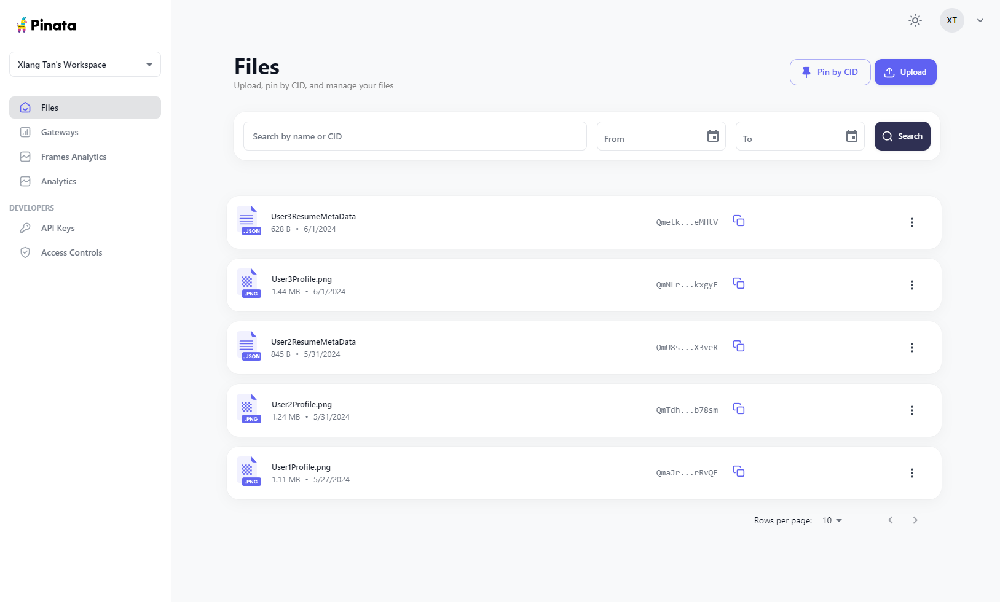
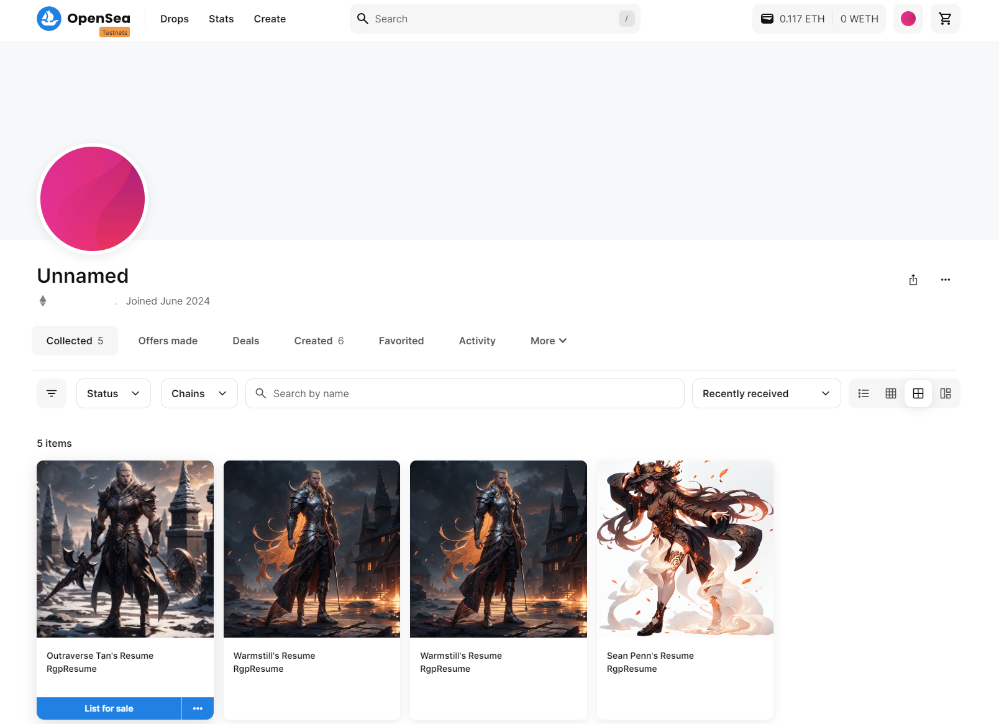
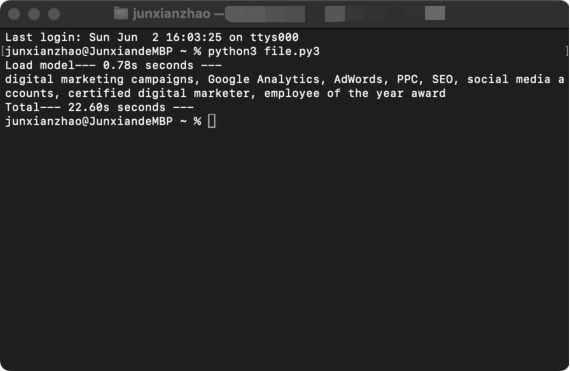

# Resume360 Global Profiler

Welcome to **Resume360 Global profile**, a revolutionary project at the intersection of AI and Blockchain technologies. This project aims to leverage the power of decentralized ledger technology to securely register, store, and search resumes as unique non-fungible tokens (NFTs) on the blockchain.

## Project Overview

Resume360 Global Profiler leverages blockchain technology to create a secure and immutable repository for resumes. Each resume is transformed into a unique NFT, with AI algorithms employed to summarize and extract key attributes. The NFTs store these attributes within their smart contracts, facilitating efficient and accurate resume searches.

## Inspiration

Applying for jobs can be incredibly tiresome. Job seekers often have to upload their resumes to multiple job sites, repeating the same process over and over. Wouldn't it be great if there was a single place where job seekers and recruiters could connect easily and efficiently?

That's where blockchain comes in. Our idea is to mint every resume into an NFT. This way, resumes are stored securely on the blockchain, making them easy for recruiters and company HRs to search through and find the best candidates. This not only streamlines the application process but also ensures that resumes are tamper-proof and accessible from anywhere.

Our goal is to develop a decentralized application that enables individuals to upload their resumes securely and efficiently, eliminating the need for repetitive submissions. Our platform will streamline the process, allowing for the creation of diverse decentralized applications that can generate and review data within a unified smart contract framework. Each resume will be represented as a unique NFT, ensuring authenticity and accessibility across various decentralized applications stored on the blockchain.

## Key Features

* NFT Representation: Resumes are tokenized into NFTs upon registration, enabling unique ownership and verification of resume authenticity.
* AI-Powered Attribute Extraction: AI algorithms analyze resumes to extract essential keywords and attributes, enhancing searchability and relevance.
* Job seekers' profile images and NFT Metadata are stored in Pinata.cloud IPFS storage before minting into NFTs. 
  
* Smart Contract Verification: Smart contracts validate the legitimacy of resumes before minting them as NFTs on the blockchain. 
  
* Blockchain Integrity: The blockchain ensures tamper-proof storage and traceability of resumes and their associated metadata.

## How It Works

1. Resume Registration: Users submit resumes through the platform, which undergo AI-based validation for authenticity and completeness.
1. AI Attribute Extraction: Resumes are processed by AI algorithms to extract keywords and essential attributes, summarizing their content.
1. Smart Contract Deployment: Upon validation, a smart contract is created for each resume-NFT pair, embedding extracted attributes and metadata.
1. NFT Minting: Valid resumes are minted into unique NFTs on the blockchain, associating them with their respective smart contracts.
1. Search and Access: Users can search and access resumes using the platform's frontend, querying keywords stored within NFTs' smart contracts.

## Challenges we ran into

1. **Resource Intensive Local Models:** Local GPT models for resume analysis typically require substantial resources, ranging from 2GB to 8GB of disk storage and 4GB to 16GB of RAM. These requirements make caching in users' browsers impractical. Additionally, generating a summary on MacBook Pro 14' 2021 with M1 Pro Chip often exceeds 20 seconds on a GPU or 120 seconds on a DELL OptiPlex 7040 Rocky Linux backend server with CPU. To address this, we deploy the model on the server side, running the analysis as a daemon process and storing the results in a database.
   
1. **Deployment Issues:** The Node.js API for GPT4All is not consistently deployed across different operating systems, such as macOS. In contrast, the Python library is more straightforward to deploy, requiring fewer environment configurations.
1. **Prompt Length:** Extensive prompts can lead to the model overlooking crucial keywords necessary for generating accurate responses. To mitigate this, we employ markdown formatting to highlight key terms, ensuring the model maintains focus on important descriptions.
1. **Debuging Solidity smart contract:** Given our limited experience with developing Solidity smart contracts, identifying and resolving issues has been particularly challenging.
1. **Chainlink Functions:** Our initial design leveraged Chainlink Functions to handle the substantial task of loading the entire resume data into the decentralized application. However, we encountered a significant limitation due to the 256-byte data cap.

## What's next for Resume360 Global Profiler

There are numerous opportunities for enhancing the project.

Our initial design aimed to utilize Chainlink Functions to query the entire resume data from a third-party Web 2.0 application. However, this approach proved infeasible due to the data size limitations of Chainlink Functions. A potential solution involves using Chainlink Functions to transmit an authentication token between web applications, leveraging Chainlink's capability to interact with off-chain data and APIs. This would add an extra layer of security through blockchain-based verification for token generation and validation.

Currently, we are utilizing a third-party AI tool to support our large language model (LLM) functionality. In the future, we could develop our own model to better tailor the process to our specific needs, enhancing customization and control over the AI-driven features.

## Contributor

* Jason Liu: ([https://github.com/ZhenqiLiu-Jason](https://github.com/ZhenqiLiu-Jason))
* Zhenyu Lin: ([https://github.com/zlin01](https://github.com/zlin01))
* Junxian Zhao: ([https://github.com/lotusknight](https://github.com/lotusknight))
* Xiang S Tan: ([https://github.com/xiangstan](https://github.com/xiangstan))

## Getting Started

* Installation
  1. [Front End](docs/Installation-Frontend.md)
  1. [Back End](docs/Installation-Backend.md)
  1. [Database](docs/Installation-Database.md)
  1. [Install Database on a Debian System](docs/Debian-Database.md)
  1. [NGiNX Web Services](docs/Installation-Webservice.md)

## File Structure

| Directory | Comment |
|-- |-- |
| /ai | Python code to run GPT4All Generated AI model |
| /contracts | Solidity smart contracts |
| /database | PostgreSQL database schema |
| /docs | Documentation |
| /src | Code base. Most front-end script with VueJS v3 framework |
| /src/server | Backend script |